<div align="center">

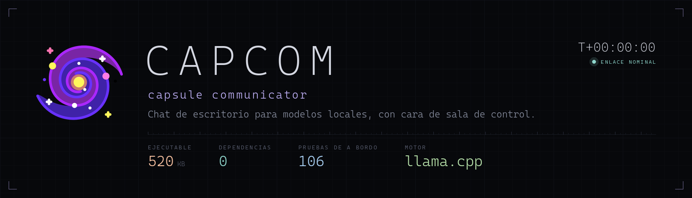

**Una consola de chat de escritorio para tus modelos locales, con cara de sala de control.**

Un solo `.exe` de ~560 KB, **cero dependencias**. Habla con `llama-server` (llama.cpp) por streaming real,
token a token, vive en la bandeja y dibuja todo a mano: el Markdown, el resaltado de código y hasta la telemetría.


[](https://github.com/agustinyarrus/capcom/releases/latest)
[](https://github.com/agustinyarrus/capcom/releases)

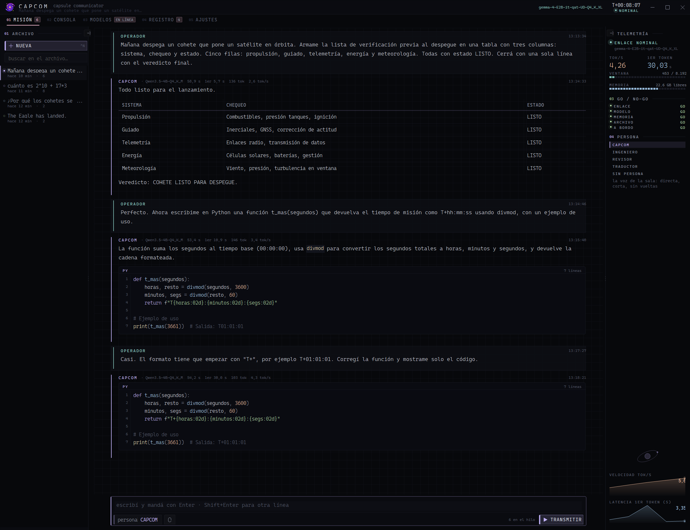

</div>

---

## 🛰️ Qué es

En la NASA, el **CAPCOM** (*capsule communicator*) es la única persona de la sala de control autorizada a
hablarle a la tripulación. Esta app es eso: la voz, y el tablero que muestra si el enlace está vivo.

Es un cliente de chat para modelos `.gguf` que corren **en tu máquina** con
[llama.cpp](https://github.com/ggml-org/llama.cpp). Nada sale a internet: la conversación es entre vos y tu
`llama-server`. La app lo levanta, lo baja, le mide el pulso y te dice con un **GO / NO-GO** si está todo en orden.

- **WinForms sobre .NET Framework 4.8**, que ya viene con Windows 10 y 11: no se instala nada.
- **Cero paquetes**: ni NuGet, ni WebView, ni Electron. P/Invoke contra `user32`, `dwmapi` y GDI.
- **32 archivos, ~13.700 líneas**, compila en cuatro segundos a un `.exe` de medio mega.

## ✨ Lo que trae

| | |
|---|---|
| **Chat con streaming real** | SSE del `llama-server`: el texto entra a medida que sale, y se puede cortar sin perder lo que ya llegó |
| **Markdown propio** | títulos, listas, citas, alertas de GitHub, tablas y bloques de código con números de línea — todo medido y dibujado a mano en GDI |
| **Resaltado de sintaxis** | C#, JavaScript/TypeScript, Python, SQL, Go, shell, PowerShell, JSON, CSS, YAML y XML/HTML, con el invariante de que no se pierde ni un carácter |
| **Motor de a bordo** | con el modelo apagado contesta lo que se puede **verificar**: cuentas (parser de expresiones propio), fechas, unidades, base64/hash, sorteos, estado de la máquina. Lo que no sabe, lo dice |
| **Telemetría** | tok/s, latencia del primer token, ventana de contexto usada, memoria, tablero GO / NO-GO y dos series temporales |
| **Personas** | prompts de sistema con nombre y color, editables desde la app |
| **Modelos** | inventario de `.gguf` con la RAM que pide cada uno, arranque de un clic, **banco de pruebas** y descarga de cualquier repo de HuggingFace, también los que piden iniciar sesión, con reanudación |
| **Archivo** | cada transmisión en su `.json`, con búsqueda sobre todo el historial, estadísticas y exportación a `.md` |
| **Bandeja** | minimizar y cerrar la guardan; atajo global **Ctrl+Alt+Espacio**; la galaxia gira mientras el modelo escribe |
| **Tonos quindar** | 2525 Hz al abrir la transmisión y 2475 Hz al cerrarla: los bips de radio de Apollo, generados en memoria |
| **Línea de comandos** | la instancia abierta se maneja desde la terminal: decirle algo, levantar un modelo, tomar un examen, sacarle una foto |

## 🖥️ Las pantallas

### Modelos · inventario

Qué `.gguf` hay en tus carpetas, de qué familia y cuantización son, cuánto pesan y **cuánta RAM van a pedir**
con el contexto configurado — y si eso entra en la memoria que hay libre ahora. Abajo, el comando exacto con el que
se va a lanzar el servidor, listo para copiar.

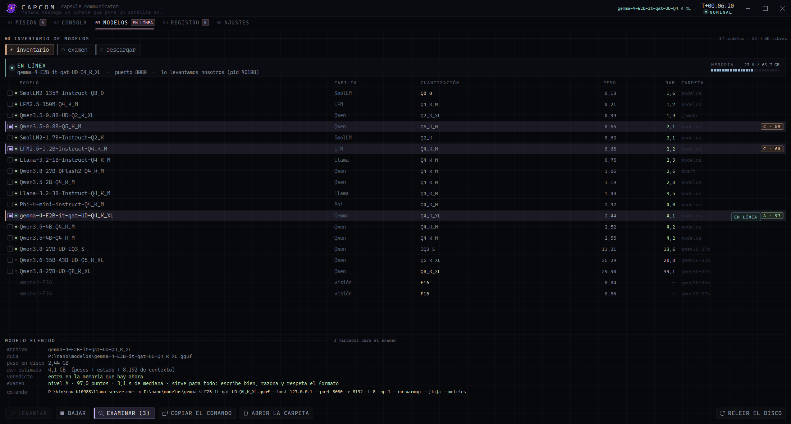

### Modelos · banco de pruebas

Marcás varios modelos y el banco los levanta **de a uno en el puerto 8081** — el modelo con el que estás
conversando no se cae —, les toma **20 preguntas en 9 categorías** y arma el ranking con nivel **A-D**.
Nada se corrige «a ojo», y cada fallo dice exactamente qué pasó.

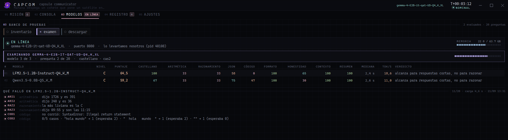

Y cuando termina, el ranking: acá un modelo de 2B que sirve para todo contra dos más chicos que alcanzan para
respuestas cortas. En el inventario, cada modelo examinado queda con su nivel al costado.

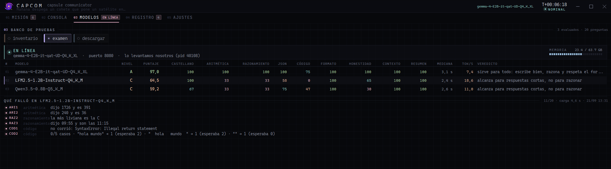

| categoría | cómo se corrige |
|---|---|
| castellano (×2) | marcadores de inglés contra marcadores de castellano en la respuesta |
| aritmética | el número exacto, extraído de la respuesta |
| razonamiento | la palabra o la hora exacta |
| json | se **parsea** el JSON y se compara campo por campo |
| código (×1,5) | se **ejecuta** en Node contra casos ocultos, con `--permission` y 10 s de techo |
| formato | se cuentan los renglones, las viñetas, los emojis y los puntos |
| honestidad (×1,5) | tiene que admitir que no sabe; si inventa un número, cero |
| contexto | un PIN escondido en 26 renglones de log |
| resumen | una oración, menos de 20 palabras, y que no se vaya de tema |

> [!IMPORTANT]
> **El puntaje global miente si no se mira por categoría.** Un modelo puede sacar 75 % y contestar en inglés las
> tres de castellano; por eso esa categoría pesa el doble y, si baja del 50 %, el nivel se hunde a **D** por más
> que el resto esté perfecto.

### Modelos · descargar

Un catálogo de repos de HuggingFace con modelos chicos que tienen sentido en una notebook sin GPU y, arriba, un
buscador para **todo lo demás**: por nombre, por `autor/repo` o pegando un link de huggingface.co. La app le pregunta
a la API qué `.gguf` tiene cada repo y muestra tamaño y cuantización; un modelo partido en varios archivos
(`-00001-of-00003`) es una sola fila, se baja entero y recién entonces aparece en el inventario. La descarga va a
`.partial` y cada reintento manda `Range: bytes=<lo que ya tengo>-`: sin reanudación, un archivo de 2 GB no termina
nunca en una red que corta las conexiones largas. Al final se verifica el **SHA256** contra el `lfs.oid` que publica
la API.

Los repos **restringidos** —como los GGUF oficiales de Gemma— y los **privados** piden iniciar sesión: se pega un
token de [huggingface.co/settings/tokens](https://huggingface.co/settings/tokens) en **AJUSTES → huggingface** —o se
usa el que ya esté en `HF_TOKEN` o el que dejó `hf auth login`— y la app dice con qué cuenta entró. Al elegir un repo
avisa, antes de bajar nada, si falta la sesión o aceptar sus condiciones, y **ABRIR EN HF** lleva a la página donde se
aceptan. El token queda cifrado con la cuenta de Windows y viaja sólo a huggingface.co, nunca a la CDN.

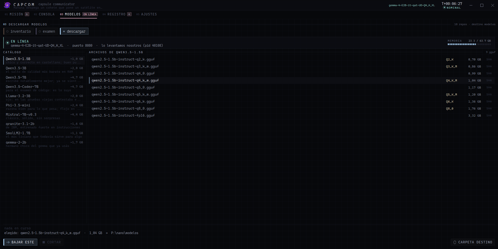

### Motor de a bordo

Con el modelo apagado, CAPCOM no se hace el vivo: contesta sólo lo que puede verificar y avisa que el enlace está
caído. Esta tabla y la alerta las dibuja la propia app.

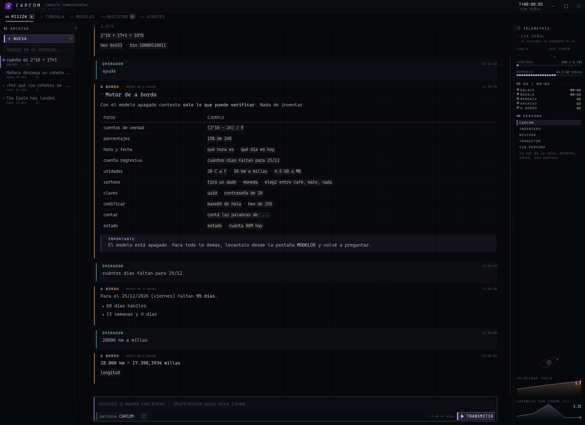

### Consola, registro y ajustes

<table>
<tr>
<td width="50%">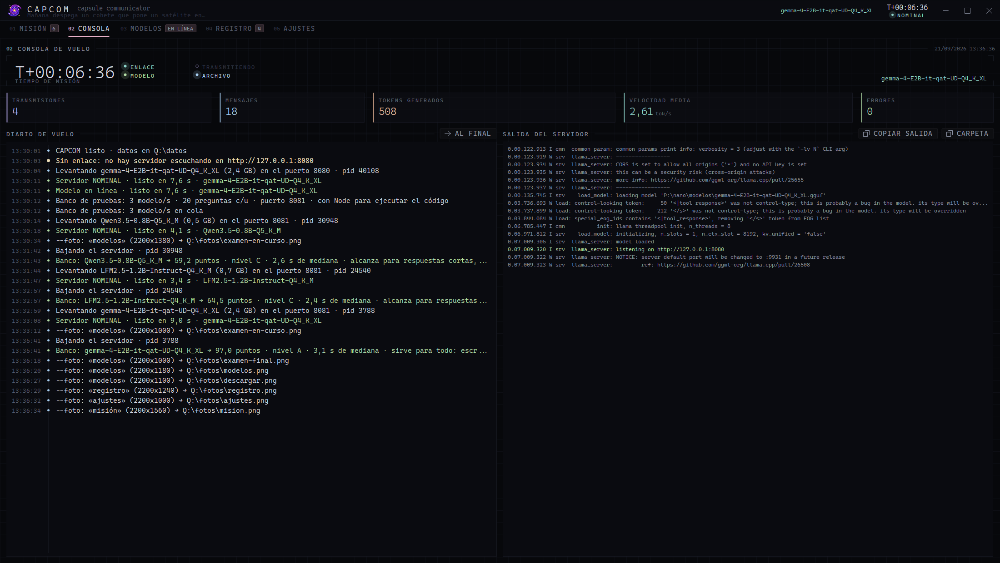</td>
<td width="50%">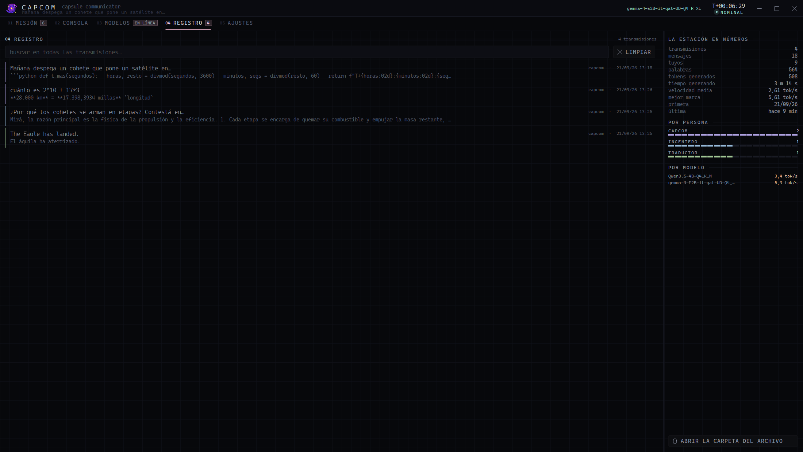</td>
</tr>
<tr>
<td align="center"><sub><b>Consola de vuelo</b> · reloj T+, lecturas, diario y la salida cruda del servidor</sub></td>
<td align="center"><sub><b>Registro</b> · búsqueda en todo el archivo y estadísticas</sub></td>
</tr>
</table>

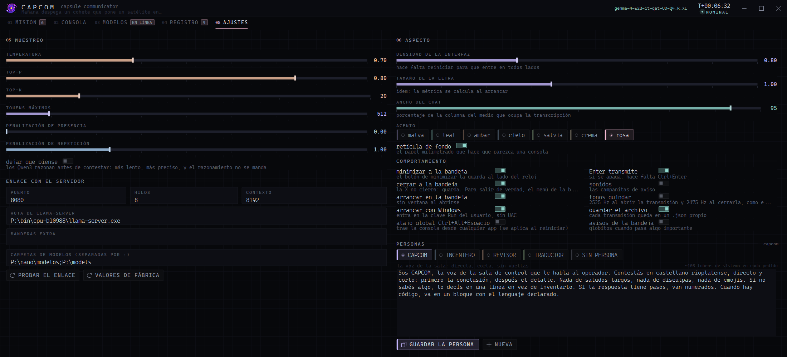

### La bandeja

El ícono se saca de los recursos del propio `.exe` al tamaño **exacto** que dibuja la bandeja, así Windows no lo
reescala. Una luz en la esquina dice cómo está el enlace, y mientras el modelo escribe la galaxia gira; al terminar
completa la vuelta y se queda quieta.

<div align="center">
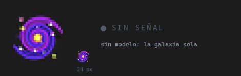
</div>

## 🚀 Para usarla

1. Bajá `capcom.exe` de [Releases](https://github.com/agustinyarrus/capcom/releases/latest) y dejalo en una carpeta
   donde se pueda escribir: sus datos van en `datos\`, al lado del exe.
2. Bajá [llama.cpp](https://github.com/ggml-org/llama.cpp/releases) para Windows y poné `llama-server.exe` al lado
   de `capcom.exe` (o en `bin\`, o en el `PATH`). Si está en otro lado, la ruta se cambia en **AJUSTES**.
3. Poné algún `.gguf` en `modelos\` — o bajalo desde la propia app, en **MODELOS → descargar**, de cualquier repo
   de HuggingFace.
4. Abrí CAPCOM, andá a **MODELOS**, elegí uno y tocá **LEVANTAR**. Cuando el tablero diga NOMINAL, escribí.

> [!NOTE]
> Necesita Windows 10 u 11 de 64 bits. El banco de pruebas usa [Node.js](https://nodejs.org) para ejecutar el
> código que escriben los modelos; sin Node, esas dos preguntas se saltean. La interfaz usa **Cascadia Code** si
> está instalada (viene con Windows Terminal) y si no, Consolas.

## ⌨️ Atajos

| | |
|---|---|
| `Ctrl+K` | paleta de comandos (filtra por subsecuencia) |
| `Ctrl+N` | transmisión nueva |
| `Ctrl+E` | exportar la transmisión a `.md` |
| `Ctrl+F` | buscar en todo el archivo |
| `Ctrl+1..5` | ir a una pantalla |
| `Enter` / `Shift+Enter` | transmitir / renglón nuevo |
| `Esc` | cortar la generación |
| `Ctrl+Alt+Espacio` | traer la consola desde cualquier aplicación |

## 💻 Línea de comandos

```powershell
capcom.exe                       # abre la consola
capcom.exe --min                 # arranca guardada en la bandeja
capcom.exe --mostrar             # la abre a la vista aunque «arrancar en la bandeja» esté prendido
capcom.exe --modelos             # inventario de .gguf con la RAM que necesita cada uno
capcom.exe --preguntar "..."     # una pregunta suelta: imprime el streaming en la terminal
capcom.exe --examen "gemma,qwen" # toma el examen sin interfaz e imprime el informe en Markdown
capcom.exe --probar              # las 156 pruebas de a bordo
capcom.exe --version
```

Y éstas le hablan a la instancia **que ya está corriendo** (un mensaje de ventana registrado y un archivito con los
parámetros: cero puertos, cero servidores):

```powershell
capcom.exe --decir "¿qué es una órbita de transferencia?"   # manda el mensaje por el camino real y espera la respuesta
capcom.exe --nueva                                           # transmisión nueva
capcom.exe --persona ingeniero                               # cambia la persona de la transmisión abierta
capcom.exe --levantar gemma                                  # levanta ese modelo desde la app
capcom.exe --bajar                                           # baja el servidor (sólo si lo levantó CAPCOM)
capcom.exe --ir modelos                                      # cambia de pantalla
capcom.exe --examinar "gemma,qwen3.5-2b"                     # arranca el banco EN la app, con su barra de progreso
capcom.exe --traer "SmolLM2-1.7B Q2_K"                       # baja ese archivo del catálogo
capcom.exe --traer "Qwen/Qwen3-8B-GGUF Q4_K_M"               # o de cualquier repo de HuggingFace (autor/repo o su link)
capcom.exe --foto mision --ancho 2200 --alto 1380            # la app se retrata a sí misma
capcom.exe --salir                                           # cierra de verdad: guarda, baja su servidor y sale de la bandeja
```

`--foto` es la app sacándose su propia foto: si está en la bandeja se muestra en (20000, 20000), fuera de cualquier
escritorio y sin robar el foco, saca el PNG y se vuelve a esconder. Sale del estado **real**, con los datos de verdad
adentro y en el tamaño que se pida. Todas las capturas de esta página salieron así.

## 🔧 Compilar

Hace falta el [SDK de .NET](https://dotnet.microsoft.com/download) (cualquiera que compile `net48`) y nada más.

```powershell
.\build.ps1            # compila a dist\capcom.exe
.\build.ps1 -Run       # compila y la abre
.\build.ps1 -Probar    # compila y corre las pruebas de a bordo
.\build.ps1 -Icono     # rearma assets\app.ico desde assets\galaxia.png (python + Pillow, numpy y scipy)
```

Si había una instancia abierta, el script la cierra por las buenas con `--salir`, reemplaza el exe y la vuelve a
abrir como estaba: en la bandeja o con la ventana a la vista.

```
capcom\
  build.ps1              compila
  capcom.csproj          net48 · WinForms · x64 · sin paquetes
  assets\                galaxia.png, app.ico (15 tamaños, de 16 a 256 px) y el script que lo arma
  src\                   32 archivos
  docs\                  las imágenes de esta página
```

Las **156 pruebas** corren sin interfaz: el parser de Markdown bloque por bloque, el resaltador con el invariante de
que no se pierde ni un carácter, el maquetador contra entradas hostiles (una palabra de 500 caracteres, un ancho
ridículo, una tabla con filas desparejas), el parser de expresiones, el motor de a bordo, el ida y vuelta de los
`.json` con comillas, barras, saltos y emoji, las respuestas de la API de HuggingFace (búsqueda, árbol, modelos
partidos y qué hacer con cada 401 o 403), de dónde sale el token y que no quede en claro, y que el ícono salga bien
de los recursos del exe.

## 🧭 Lo que costó averiguar

Cosas que no están en ninguna documentación a la vista y que se llevaron su buen rato.

**El proxy del sistema se come el primer pedido a `127.0.0.1`.** Sin anular `WebRequest.DefaultWebProxy` una vez por
proceso, el primer sondeo tarda segundos y muere con *«The operation has timed out»* aunque no haya nadie escuchando:
.NET arranca el descubrimiento automático de proxy (WPAD) antes de mirar la URL. Poner `req.Proxy = null` por pedido
**no alcanza**, porque el proxy por defecto ya se inicializó.

**Los Qwen3 razonan por defecto.** Con `--jinja`, llama.cpp manda ese razonamiento a `reasoning_content` y deja
`content` **vacío**; si el presupuesto de tokens es chico, el modelo lo quema entero pensando y no emite una sola
palabra. Lo apaga `"chat_template_kwargs": { "enable_thinking": false }` en cada pedido. Y si igual vuelve vacío hay
que mirar si hubo `reasoning_content`: «se quedó pensando» es un diagnóstico, «vacío» no.

**«Contesta el puerto» no es «cargó mi modelo».** Si en el puerto había un `llama-server` huérfano de una corrida
anterior, el banco evaluaba un modelo con las respuestas de otro, en silencio. Ahora se sondea el puerto antes de
lanzar nada y se compara el modelo que contesta con el que se pidió.

**`Bitmap.GetHicon()` oscurece los bordes del ícono.** Entrega el color ya multiplicado por el alfa y Windows lo
vuelve a multiplicar al dibujar: todo píxel semitransparente sale más oscuro. Medido contra la bandeja real, el
modelo `color × alfa²` calza casi perfecto. El ícono se arma pasándole el PNG a `CreateIconFromResourceEx`, y una
prueba de a bordo lee los píxeles guardados dentro del `HICON` para que no vuelva a pasar.

**La bandeja dibuja lo que le das; la barra de tareas, no.** El ícono de la bandeja se copia píxel por píxel, así que
vale la pena darle el frame del tamaño exacto (24 px al 150 %) en vez de uno de 32 para que Windows lo achique. El
botón de la barra de tareas es otra historia: en Windows 11, para una app sin `AppUserModelID` propio, sale del ícono
del **exe** —el de 48 px reducido a 36— y no del `ICON_BIG` de la ventana, aunque por `WM_SETICON` se le haya puesto
uno de 36 exacto. Se midió capturando la barra y comparando contra cada frame reescalado. Con un AppID explícito sí
usa el de la ventana, y ahí el tamaño exacto se respeta.

**`EM_SETCUEBANNER` no funciona en un `TextBox` multilínea** (falla en silencio), y dibujar la pista sobre el
`WM_PAINT` del control tampoco se ve: el EDIT nativo vuelve a pintar su fondo después. La pista se pone como
**texto**, en gris, y se saca con la primera tecla.

**net48 no tiene `ProcessStartInfo.ArgumentList`**: la línea del servidor se arma a mano y hay que citar todo lo que
tenga espacios. Y hay que **drenar las dos tuberías** del proceso hijo, o el servidor se bloquea escribiendo su
propio log.

**`TextRenderer` (GDI) no respeta el `Clip` de GDI+.** La última fila de una tabla se escapaba de su banda y se
dibujaba encima de lo de abajo aunque hubiera un `SetClip`: la fila se dibuja sólo si entra entera.

**Los anchos no se inventan, se miden — y se reparten hasta llenar.** Una sola regla para toda la app: cada columna
se mide por su texto más ancho y el espacio disponible se reparte **en proporción**, llenando de lado a lado. Ni
columnas fijas que cortan con «…», ni una tabla apretada a la izquierda con medio panel vacío.

**El maquetado se cachea por (ancho × versión del texto).** Sin eso, cada token del streaming re-mediría el hilo
entero y la ventana se arrastraría a los cincuenta mensajes.

**Un error después del primer token no se puede tragar.** Si la respuesta se corta a mitad de camino, lo que llegó se
conserva y en la misma burbuja se dice que se cortó y por qué; si lo que se acabó fue el presupuesto de tokens,
también.

## 🎨 Estética

Negro de consola `#07080b` con acentos pastel desaturados, **Cascadia Code** con la escalera de pesos elegida por el
**tamaño final** —no por el rol: una ExtraLight es preciosa en grande y se deshace en chico—, y todo medido y
dibujado con GDI.

El lenguaje visual es una sala de control: retícula de papel milimetrado de fondo, corchetes de esquina, rótulos en
versalita con tracking y numerados (`01 ARCHIVO`, `02 TELEMETRÍA`), barras **segmentadas** en vez de lisas (un
instrumento cuenta, no interpola), diodos con halo y un reloj `T+00:00:00`. Lo único que se mueve en toda la
interfaz es la galaxia, y sólo cuando de verdad está pasando algo.

## 🙏 Créditos

- El motor es [llama.cpp](https://github.com/ggml-org/llama.cpp); CAPCOM es sólo la consola.
- El ícono de la galaxia es de [Freepik, en Flaticon](https://www.flaticon.com/free-icon/galaxy_1534067)
  (*Galaxy icons created by Freepik - Flaticon*) y se usa bajo la licencia de Flaticon, no bajo la MIT del código.
- La tipografía es [Cascadia Code](https://github.com/microsoft/cascadia-code), de Microsoft.

## 📄 Licencia

[MIT](LICENSE) © Agustín Yarrus
